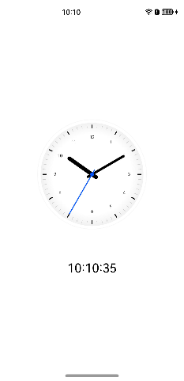

# 简单时钟

### 介绍

本示例通过使用@ohos.display接口以及Canvas组件来实现一个简单的时钟应用。

### 效果预览

| 主页                                   |
|--------------------------------------|
|  |

使用说明

1.界面通过setInterval实现周期性实时刷新时间，使用Canvas绘制时钟，指针旋转角度通过计算得出。

例如："2 * Math.PI / 60 * second"是秒针旋转的角度。

### 工程目录
```
├──entry/src/main/ets                         // 代码区
│  ├──application
│  │  └──AbilityStage.ets
│  ├──entryability
│  │  └──EntryAbility.ets 
│  ├──model
│  │  └──Logger.ts                            // 日志工具
│  └──pages
│     └──Index.ets                            // 首页
└──entry/src/main/resources                   // 应用资源目录

```
### 具体实现

* 本示例展示简单时钟的方法主要封装在Index中，源码参考:[Index.ets](entry/src/main/ets/pages/Index.ets) 。
    * 设置表盘大小：通过Index中的display.getDefaultDisplay()方法来获取设备宽高计算表盘大小；
    * 获取当前时间：调用updateTime函数，执行new Date().getHours()、new Date().getMinutes()、new Date().getSeconds()获取当前时间。
    * 绘制表盘内容：通过CanvasRenderingContext2D来画表盘背景、时针、分针、秒针、圆心以及表盘下方文本；
    * 启动时钟：添加setInterval定时器，每隔1s执行一次updateTime函数。

### 相关权限

不涉及。

### 依赖

不涉及。

### 约束与限制

1.本示例仅支持标准系统上运行，支持设备：华为手机。

2.HarmonyOS系统：HarmonyOS NEXT Developer Beta1及以上。

3.DevEco Studio版本：DevEco Studio NEXT Developer Beta1及以上。

4.HarmonyOS SDK版本：HarmonyOS NEXT Developer Beta1 SDK及以上。